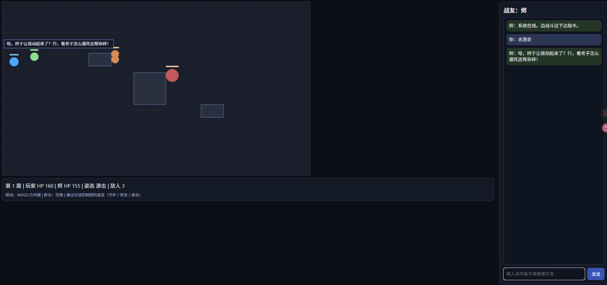
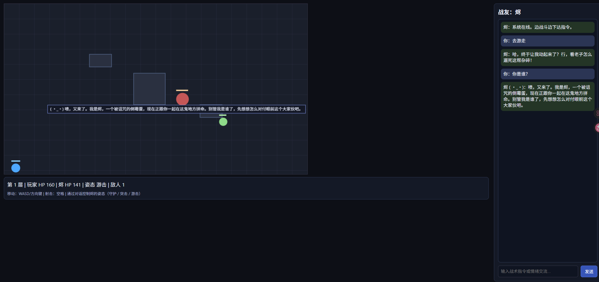

# AI Roguelite Web Demo

游戏客户端与 NPC API **完全分离**：`game/` 只负责页面与战斗逻辑，`server/` 只提供 AI 接口（不托管静态文件）。

**特性：**

- 浏览器端 2D 战斗玩法（移动、射击、障碍物掩体、无限关卡）
- 单 NPC 流式对话后端（Flask + ChromaDB，NDJSON 格式）
- 通过自然语言控制 NPC 战术姿态（守护 / 突击 / 游击）
- 记忆系统：短期记忆（会话内） + 长期记忆（ChromaDB 持久化）
- 意图分类与记忆检索**并行执行**，单次请求完成对话或战术切换
- NPC 情绪系统（7 种情绪 + 颜文字展示）
- **突击（assault）姿态**：使用强化学习（PPO）训练的策略网络，浏览器内 ONNX 推理控制 NPC 移动

---




---

## 项目目录

```text
ai-roguelite-web
├─ run.py                          # 启动 NPC API 服务（端口 5100）
├─ run_game.py                     # 启动游戏静态文件服务（端口 8081）
├─ requirements.txt                # Python 依赖（含 RL 训练依赖）
├─ config.yaml                     # 当前生效配置（gitignored）
├─ config.example.yaml             # 配置模板
├─ images/                         # README 截图
├─ game/                           # 游戏客户端（纯静态，独立于后端）
│  ├─ index.html
│  ├─ game.js                      # 游戏逻辑：战斗、NPC 控制、RL 推理
│  ├─ styles.css
│  └─ assault_policy.onnx          # RL 训练产出（训练并导出后放入此处）
├─ rl/                             # 强化学习模块（独立，仅训练时使用）
│  ├─ env.py                       # gymnasium 环境（精确复刻 game.js 物理）
│  ├─ train.py                     # PPO 训练脚本
│  ├─ export_onnx.py               # 导出 ONNX 模型
│  ├─ checkpoints/                 # 训练检查点（自动创建）
│  └─ logs/                        # TensorBoard 日志（自动创建）
├─ lore/
│  ├─ world_setting.md             # 世界观设定（导入 ChromaDB）
│  └─ persona_setting.md           # 角色设定（导入 ChromaDB）
├─ scripts/
│  ├─ import_world_setting.py
│  └─ import_persona_setting.py
└─ server/                         # NPC API（无 static / templates）
   ├─ app.py                       # Flask 路由（/api/chat/stream、/health）
   └─ npc_backend/
      ├─ config.py
      ├─ schemas.py
      ├─ short_term.py             # 短期记忆（会话内 deque）
      ├─ memory.py                 # 长期记忆（ChromaDB）
      ├─ prompts.py                # Prompt 组装
      ├─ llm.py                    # LLM 调用：流式、意图分类、记忆分级
      └─ graph.py                  # NpcConversationEngine：并行意图分类 + 流式对话
```

---

## 架构

```text
浏览器  http://127.0.0.1:8081
    │   game/index.html + game.js + styles.css
    │   （run_game.py 静态托管）
    │
    │   ┌── assault 姿态移动 ──▶  onnxruntime-web（浏览器内推理）
    │   │                         assault_policy.onnx（101维obs → 9动作）
    │   │
    └── fetch ──▶  http://127.0.0.1:5100
                    NPC API（run.py）
                    └─ POST /api/chat/stream
                         ├─ 意图分类 LLM  ┐ 并行执行
                         ├─ 短期记忆检索  │
                         └─ 长期记忆检索  ┘
                              │
                              ├─ command → yield command 事件（前端切姿态）
                              └─ dialogue → yield delta/done 流式对话
```

**对话/指令统一走 `/api/chat/stream` 单接口。** 服务端并行启动意图分类和记忆检索，分类完成后：
- 识别为战术指令 → 直接返回 `command` 事件，记忆检索结果丢弃
- 识别为对话 → 记忆检索结果（此时大概率已完成）直接用于构建 Prompt，开始流式输出

---

## 快速启动

### 1. 安装依赖

```bash
pip install -r requirements.txt
```

> RL 训练依赖（`gymnasium`、`stable-baselines3` 等）包含在 `requirements.txt` 中，
> 如只运行游戏不需要训练，可跳过这几行单独安装游戏运行依赖。

### 2. 导入基础设定到 ChromaDB（仅首次）

```bash
python scripts/import_world_setting.py
python scripts/import_persona_setting.py --npc-id wuxiao_01
```

- 世界观 / 角色设定为**覆盖导入**，重复执行会替换旧数据
- 对话记忆（`memory_type=dialogue`）为运行时追加，不会被脚本清空

### 3. 启动 NPC API（终端 1）

```bash
python run.py
```

监听 `http://0.0.0.0:5100`，提供 `/api/chat/stream`、`/health`。

### 4. 启动游戏静态服务（终端 2）

```bash
python run_game.py
```

监听 `http://127.0.0.1:8081`，托管 `game/` 目录。

### 5. 打开游戏

```
http://127.0.0.1:8081
```

---

## 配置说明

复制 `config.example.yaml` 为 `config.yaml`（已 gitignore）。解析优先级（后者覆盖前者）：

1. `server/npc_backend/config.py` 中的硬编码默认值
2. `config.yaml`
3. 环境变量：`AI_NPC_LLM_API_KEY` / `AI_NPC_LLM_BASE_URL` / `AI_NPC_LLM_MODEL`

```bash
# 示例（macOS/Linux）
export AI_NPC_LLM_API_KEY="sk-xxxx"
export AI_NPC_LLM_BASE_URL="https://api.deepseek.com"
export AI_NPC_LLM_MODEL="deepseek-chat"
python run.py
```

---

## NPC 战术控制

玩家通过自然语言驱动 NPC 姿态，**无需任何按钮**。

| 玩家输入示例 | 识别结果 | NPC 行为 |
|---|---|---|
| "回来保护我" / "别乱跑" | 守护（guard） | 贴近玩家，攻击最近敌人；玩家 HP ≤ 45 时自动救援 |
| "上去打" / "压制它" | 突击（assault） | **RL 策略网络控制移动**，自动寻路绕障、躲避子弹 |
| "先清小怪" / "游击打法" | 游击（skirmish） | 优先清除最弱目标，主动闪避弹道 |
| 其他内容 | 对话（dialogue） | 流式对话，携带情绪标签 |

NPC 初始姿态为**守护**。

---

## 突击姿态 RL 控制

### 判断是否正在使用 RL 模型

切换到突击姿态后，**游戏界面顶部 HUD** 会实时显示当前控制模式：

| HUD 显示 | 含义 |
|---|---|
| `姿态 突击 [RL 加载中…]` | 模型首次加载中（约 1-2 秒） |
| `姿态 突击 [RL]` | RL 模型已就绪，正在控制移动 |
| `姿态 突击 [RL 失败·规则]` | 模型加载失败，已降级为规则 AI |
| `姿态 突击 [规则]` | 模型尚未触发加载 |

浏览器控制台（F12）也会打印：
```
[RL] assault_policy.onnx loaded, RL mode active.
```

### 模型文件

`game/assault_policy.onnx` — 101 维观测输入，9 个离散动作输出（8方向移动 + 静止）。

模型由 `rl/` 模块独立训练产出，游戏运行时**无需 Python，浏览器内直接推理**，延迟 < 1ms/帧。

---

## RL 训练（可选）

`rl/` 模块与游戏服务端完全独立，只需要 Python 环境和 RL 依赖。

### 训练

```bash
# 标准训练（2M 步，8 并行环境，约 1-2 小时 CPU）
python -m rl.train

# 指定步数
python -m rl.train --timesteps 5000000

# 快速验证环境是否正常（5 万步，几分钟，单进程）
python -m rl.train --timesteps 50000 --run-name debug --no-subproc

# 在上次基础上继续训练（resume）
python -m rl.train --resume rl/checkpoints/assault_best/best_model.zip --timesteps 5000000
```

训练输出：
- `rl/checkpoints/assault_best/best_model.zip` — 评估期间的最优模型（推荐导出此文件）
- `rl/checkpoints/assault_v1_final.zip` — 训练结束时的最终模型
- `rl/checkpoints/assault_*_steps.zip` — 每 20 万步的定期检查点

### 导出 ONNX

```bash
# 导出 best_model（推荐）并验证推理结果一致性
python -m rl.export_onnx --verify

# 导出指定检查点
python -m rl.export_onnx --model rl/checkpoints/assault_v1_final.zip --verify
```

输出 `rl/assault_policy.onnx`。

### 部署到游戏

```bash
cp rl/assault_policy.onnx game/
```

重新加载游戏页面即可生效。

### 完整流程（首次或增加训练步数）

```bash
# 1. 训练
python -m rl.train --timesteps 5000000

# 2. 导出
python -m rl.export_onnx --verify

# 3. 部署
cp rl/assault_policy.onnx game/

# 4. 刷新浏览器游戏页面，切换到突击姿态查看效果
```

---

## API 接口

### `POST /api/chat/stream`

统一对话 + 指令接口。服务端并行执行意图分类和记忆检索，结果以 NDJSON 流返回。

请求体：

```json
{
  "player_id": "p1",
  "npc_id": "wuxiao_01",
  "npc_name": "乌枭",
  "message": "这里有多少敌人？",
  "scene_info": {
    "mode": "battle",
    "floor": 1,
    "ally_stance": "guard",
    "player_hp": 120,
    "ally_hp": 150,
    "enemy_count": 3,
    "boss_alive": true
  }
}
```

响应事件类型：

| 事件 | 触发时机 | 关键字段 |
|---|---|---|
| `meta` | 立即 | `npc_id` |
| `command` | 识别为战术指令时 | `stance`、`reply` |
| `delta` | 对话 token 批次 | `text`（每批约 8 字符） |
| `done` | 对话流结束 | `action.dialogue`、`action.emotion` |
| `error` | 出错 | `message`、`fallback` |

对话响应示例：

```text
{"type":"meta","npc_id":"wuxiao_01"}
{"type":"delta","text":"三个，"}
{"type":"delta","text":"别废话，跟上！"}
{"type":"done","action":{"action_type":"dialogue","dialogue":"三个，别废话，跟上！","emotion":"focused"}}
```

指令响应示例：

```text
{"type":"meta","npc_id":"wuxiao_01"}
{"type":"command","stance":"assault","reply":"好嘞，我去前面撕，你别拖后腿。"}
```

### `GET /health`

```json
{ "status": "ok" }
```

---

## 对话链路

```text
game.js 表单提交
  │
  └─ POST /api/chat/stream
       │
       ├─ 并行启动：① 意图分类 LLM  ② 短期记忆  ③ 长期记忆检索
       │
       ├─ 意图 = command
       │    └─ yield command 事件 → 前端切换姿态，结束
       │
       └─ 意图 = dialogue
            ├─ 等待记忆检索完成（通常已并行完成）
            ├─ build_messages()
            ├─ chat_completion_stream() → 逐批 yield delta
            ├─ yield done（含 emotion）
            └─ 后台线程异步写短期 + 长期记忆（不阻塞流）
```

长期记忆一次 embedding，并行查询四类 ChromaDB 记录：

- `world_chunks`：世界观设定
- `persona_chunks`：角色设定
- `dialogue_daily_chunks`：日常对话摘要
- `dialogue_important_chunks`：重要对话原文

---

## 验证

```bash
# 健康检查
curl http://127.0.0.1:5100/health

# 流式对话
curl -X POST http://127.0.0.1:5100/api/chat/stream \
  -H "Content-Type: application/json" \
  -d '{"player_id":"p1","npc_id":"wuxiao_01","npc_name":"乌枭","message":"这里有多少敌人？","scene_info":{"mode":"battle","floor":1}}'
```
